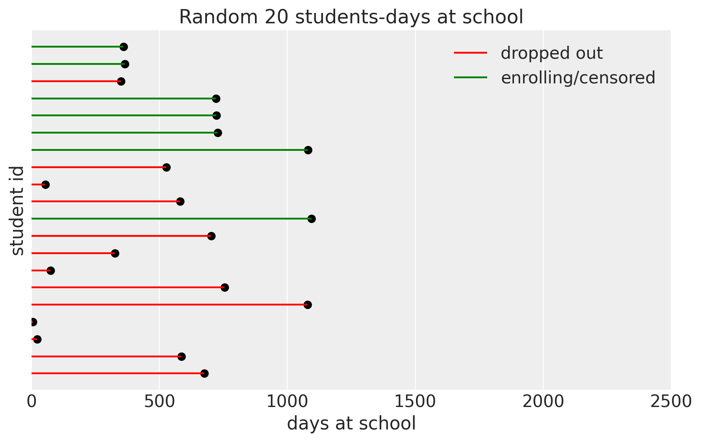
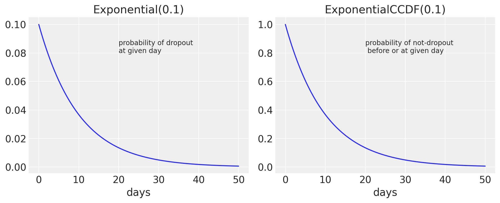
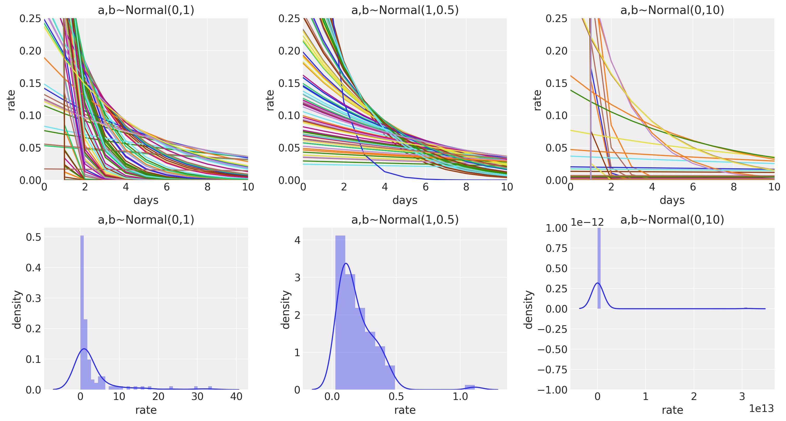
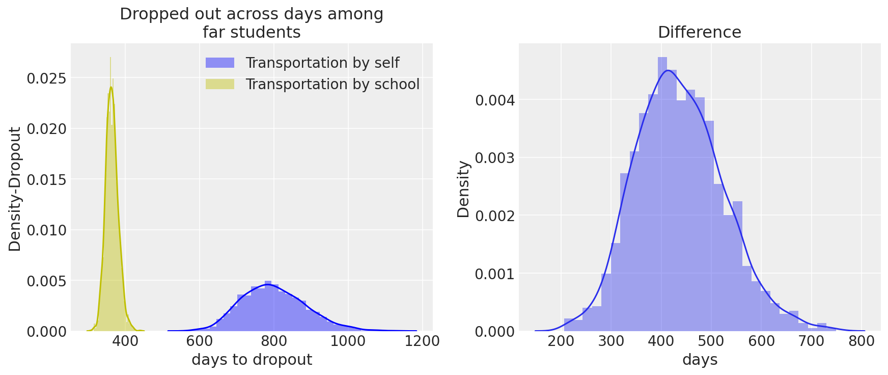
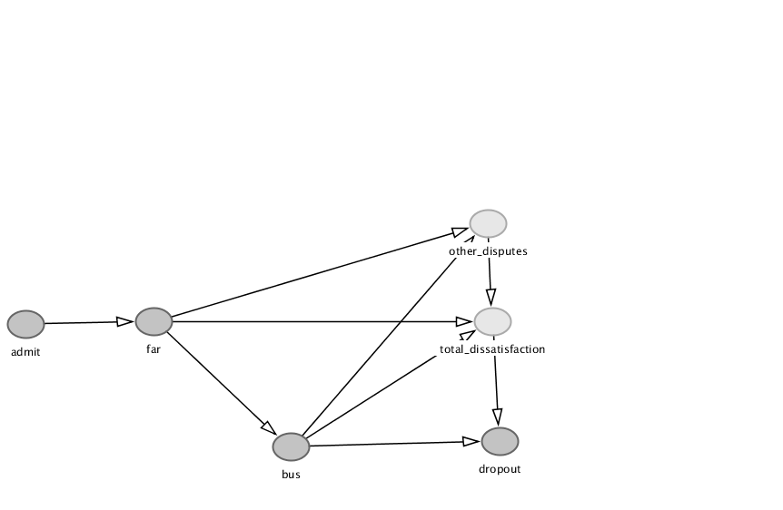

# Evaluating Rate of an Event 
*A simple Business case*
---
*Keywords: Operations/Administration, Causal Model, Probabilistic Model, Bayesian Statistics, Python, Pymc3*

## Introduction
___
Businesses are often interested to know about the rate at which their customers enroll and quit. It is through these rates any business decides upon its customer retention strategies and evaluates lifetime values from each customer

In this project we are considering some schools' data; we are interested in the dropout rate of our students during their junior years where it is presumed that the admissions & dropouts are particularly high.

Understanding such rates are crucial for schools for mainly two reasons; first, they can further investigate the causes to student's dropout and improve the system by making right inference and second such rates helps school evaluate the lifetime value of each student which helps schools to spend wisely.

## Hypothesis
Although many factors lead students to quit school we can quickly start analyzing few known properties of our students which are already in our system. In this example, we are interested in improving customer retention and further want to investigate upon factors particularly we want to check our Bus Administration’s performance. Thus we can formulate our Hypothesis as

>What is the *difference* in dropout rates for students who uses bus and who doesnot uses bus across all *far* students ?Are those differences significant?

*Check the Generative Model at the end of this to further understand the phenomenon. Also code to replicate this can be found in this [notebook](https://github.com/roesta07/Survival-Models-in-Businesses/blob/main/Survival_Models.ipynb)*.

## Problems and Challenges
One problem with these types of analyses is that the dataset represents a certain time window. There will be a mix of students currently continuing and students who have dropped out in the dataset.This can create confusion as the students currently continuing their academics will still be in that dataset but we are interested in only drop-out rates and therefore an instinct will be to ***delete data*** of students who haven't dropped out.

But *this is a mistake* and can cause ***biased estimates*** because the students who have not dropped out until we download the data give us information about the dropout rate by representing that they haven't dropped out. 

This is confusing, but one loose example to understand this can be simple as; the probability of head gives us information about probability tail as they are *complementary* of each other.

 

*Fig:student's enroll/dropout status*

## Survival Models
Such data are called censored Data and now you could guess why it’s called censored. Survival models are goto models for such data. Survival analysis has been used for data involving time to a certain event such as death, the onset of a disease,  or other biology, but we can borrow its applications in business. Here we will be using a simple version of Survival models and using Exponential Distribution for our likelihood.
### Exponential Distribution And its Assumptions
The Exponential Distribution is the probability distribution of the time between events in which such events occurs continuously and independently at the constant average rate.

It has only one parameter lambda  . The lambda parameter is the rate of an event happening; which is exactly what we wanted to figure out.
Also, The memorylessness feature of exponential distribution state that every day each student have some constant rate of dropping out every day. This is a little unfair with students with higher classes but this assumption is close to the truth for students in junior years.

## Model 
let, 
*days to event* 
*dropout rate* 

where,

 
Priors:  
  
 

For students who have dropped their dropout rate is just Exponentially distributed as per our assumption but for students who have not yet dropped out, we can incorporate their information using Exponential CCDF which is just the cumulative complementary of Exponential Distribution. For example since a student has not yet dropped out till day 25 is the probability of not-dropout before or on 25th day.
We can further explore these topics mathematically.

The above notation can be further written as

 

We also want to control for weather students live far or not so that we want to know that is there stil some strong association between bus service and dropout.

## Priors
Priors are your beliefs about our parameters before seeing the data. It’s just a way of telling our model that what is infinity and whats not. You can also incorporate your expert beliefs, findings you’re your previous studies or even some sensible reasoning about your parameter into your prior.

In this example, we are estimating the Dropout Rate of each student per day i.e parameter  . Before even seeing the data we can have some reasoning about this parameter; even though we can’t exactly estimate what value  can take right now but we know what values it cannot take. For instance, imagine  is 0.50 or more i.e dropout rate of each student per day is 50 % more; we know for certain that no school can even think of running a successful business with that dropout rate until and unless it’s into some serious money-laundering. Of course, we can do far  better than that but even a simple restriction can improve our model’s estimation because our model does not have to go look for impossible infinite space. We want  to fall under 0.5 and increase our beliefs as we move below.

But our beliefs should to converted into mathematical notation for our model to make sense. And, Eliciting priors especially on these kinds of Generalized Linear Models(glms) is tricky because we have morphed the parameters using some link function to our glms. Therefore it’s always suggested plotting the priors. 

 

*Fig: Prior Predective simulations for 3 different beliefs*

The plot in the middle exactly goes with our beliefs as you can see from the fig (*bottom-mid*) our beliefs about the dropout-rate   fall under 0.5 and the mass increases as we move below
The middle plot exactly goes with our belief

 

</break>

where,

## Implementations and Findings:

After setting up all the information we needed to run the model we can just wait and let the model run; this may take few minutes. *The code to replicate this model is found in this [notebook](https://github.com/roesta07/Survival-Models-in-Businesses/blob/main/Survival_Models.ipynb)*.
There are lot of things that goes inside the model when you run your model from Pymc3.But the complicated process behind this model can be expressed in simple words that *it is just updating our prior beliefs* which was stated earlier as prior with the evidence we provided as data. These updated beliefs are now called posteriors.

In the table below; summary of the posterior  

|   	                    | mean	                |   sd      |hdi_3%     |hdi_97% |
|--:	                    |--:	                |--:	    |--:        |--:     |
|  lambda\|far,no_bus 	    |   0.001	            |  0        |0.001        | 0.002         |
|  lambb\|far,bus           |   0.003	            |   0	    |0.003      |0.003      |

*Table:Paramete Summary*

These parameters can be further explained with the help of a graph;

 

*Fig-Posterior*

From the graph above; Our guess was true; there is something wrong with our Bus Administration. Among far-students, those who use the bus tend to drop out early from school than those who do not.
Also, we can see that the uncertainty is less among students who use the bus: why? Because more students who live far tends to use bus service rather than manage transportation by self.
### Conclusion
But the point of all this is to make an Inference; although there is a quite noticeable difference of about a year between these two groups, it’s not a yet a good idea to point all the fingers towards bus administration. Science is not this simple ean specially with these observational data, there can be a lot of factors and confounders affecting the measure of our interest. After inclusion of such information we might have some paradoxical effect on the findings we know now. But we are now closer to the truth and we know where to start now; at least we can have some good discussions with our bus administration and further investigate. 

## Generative Model
I have used this cartoonish version to explain how the data is being generated and simulated under certain stated assumptions below.

 

*Fig:Directed Acyclic Graph*

* Each year during admission sessions students get admitted to the School through some Poisson process.
We expect *70% of students to be within a 5 km* radius from the school's location and the rest 30% beyond the 5 km radius represented with variable *far*.
The school arranges bus service for most of those students who are **far**  but not all far-students use the bus.
There is a chance that each parent, each day may have some disputes with the school administration; for our type of measurement, we have aggregated such disputes into mainly 3 sources. First, disputes may arise from group of parents/students who live *far* i.e beyond a 5km radius, Second disputes may come from dissatisfaction with using School's Bus service, and third disputes are the rest of all other disputes that can happen between parents and the administration. 

* These disputes are not measured and are not in our dataset; however, the information of such disputes flows towards student's dropout rate.

* And just like in any other system of dissatisfaction and disputes if the administration handled them properly they are resolved else it stacks and grows until such disputes take into some event leading to drop-out

*You can use this [code](https://github.com/roesta07/Survival-Models-in-Businesses/blob/main/data_generation/generative_model.py) to simulate the data.*

